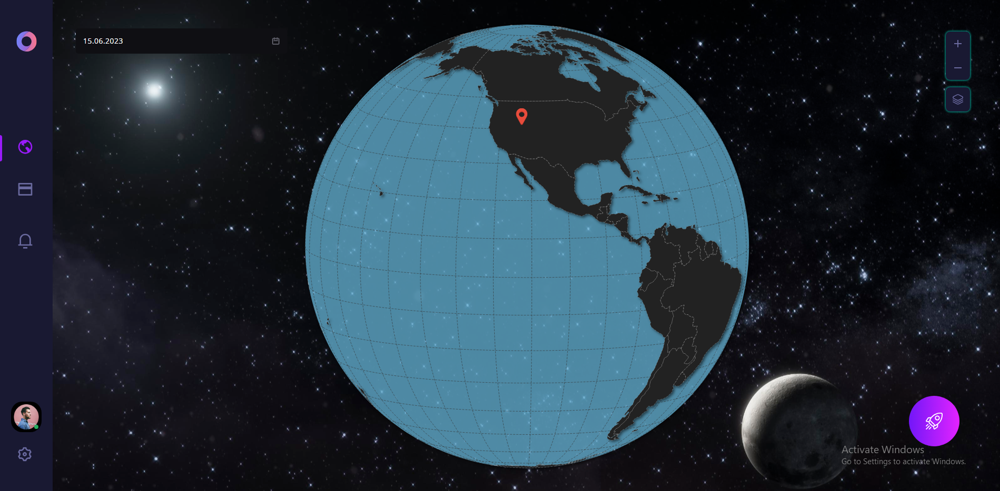

# SpaceVision

# Fontend

    React+MUI+Chart
    npm start
    localhost:3000

# Backend

    Python+Django+AI+DataAnalysis
    python manage.py
    localhost:8000
    https://api.thespacevision.net

# Deploy

    https://thespacevision.net
    using PnrHost CPanel
